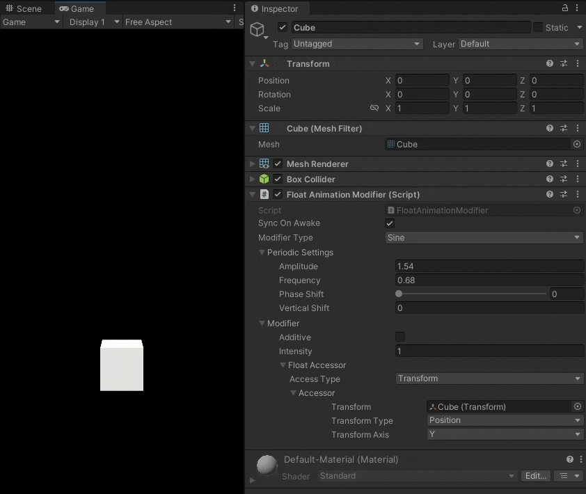
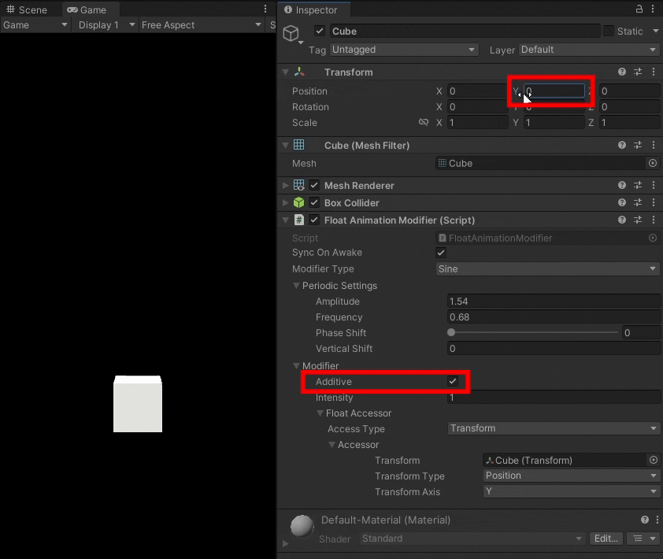
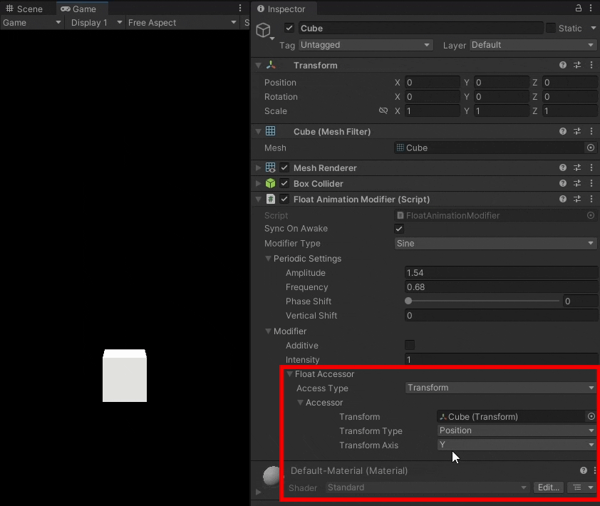

# Unity Animation Modifiers
Provides components that can use equations to control any value in the Unity editor without needing to write additional scripts. It works similarly to animation modifiers in Blender or expressions in AfterEffects.

https://github.com/ollyisonit/UnityAnimationModifiers/assets/56850051/90d3e5ed-06d8-4b77-a2e1-c5d7da253a5e

## Feature Overview

The `Animation Modifier` component allows you add basic animation to your Unity scene without needing to write any extra scripts. Here's an example where a `Float Animation Modifier` is being used to animate the Y position of the transform it is attached to:

One of the most powerful features of Animation Modifiers is that they can be set to additive mode, which adds the animation over the current value instead of overwriting it. This allows animation modifiers to edit values that are being accessed by other scripts without conflict:

Lastly, animation modifiers take advantage of the [UnityValueAccessors](https://github.com/ollyisonit/UnityValueAccessors) library to allow you to dynamically select different attributes to control on-the-fly:

 
## Usage Guide

 ### The Float Animation Modifier
 In order to use an Animation Modifier, you need to attach a FloatAnimationModifier to an object in your scene. It will contain several fields:
 
 - `Sync On Awake`: Should the time used in the modifier be synced with `Time.realtimeSinceStartup`?
 - `Modifier Type`: What type of modifier do you want to use to generate your value? The options are:
	 - `Noise`: Generate values using a perlin noise function, which will give random values with smooth transitions between them
	 - `Sine`: Generate values using a sine wave
	 - `Custom Curve`: Generate values using an animation curve drawn in-editor
	 - `Custom Equation`: Generate values using an equation you type into a text box
	 - `Custom`: Use a modifier script that you wrote yourself
	 
	 Depending on the type of modifier you pick, you will get slightly different settings. However, all modifiers share an `Additive` tickbox, which lets you pick whether you want the value from the modifier to be added on top of the original value, and an `Intensity` value, which the modified value is multiplied by before it is returned. 
	 
	 All modifiers also share a `Float Accessor` field, which allows you to select the value that you want to modify. [You can find more information on Accessors here.](https://github.com/ollyisonit/UnityValueAccessors)

### Periodic Settings
`Noise`, `Sine`, and `Custom Curve` are all periodic modifiers, meaning that they can be scaled over time. When you have one of these modifiers selected, you will have access to the Periodic Settings menu, which contains four settings:

 - `Amplitude`: The maximum value that the modifier can reach
 - `Frequency`: The speed at which the modified value changes (in Hz)
 - `Phase shift`: How much the modifier should be offset over time
 - `Vertical shift`: A constant value to be added to the modifier

### Custom Equations
When using custom equations, you should type the equation you want to use without an '='. You can use "t" to refer to the time since the modifier was started in seconds. Some examples of equations that you could use are:

 - `t + 1`
 - `sin(t)`
 - `(10 * t) ^ 5`
 - `Noise(10,t) * 6`

The modifier uses the [mxparser](https://github.com/mariuszgromada/MathParser.org-mXparser) library to read equations, so any functions supported in that library will be supported here.
Additionally, you can use `Noise(seed, time)` to generate random Perlin noise in the same way that the Noise modifier does.

The `Dynamic` tickbox below the equation textbox tells the program whether the equation should be re-parsed each time it is evaluated. This will probably slow down your game, so you should only ever check this box if you know you are going to be changing the equation while the game is running.

Custom equations also support the use of variables that reference other values in your scene. For example, you may want to include the x component of another object's transform in your equation. In order to do this, you can add a variable to the Variables array below the 'Dynamic' tickbox. Each variable has a name, which you should use to refer to it in your equation, and a `FloatValueAccessor`, which tells the variable where to get its value from.

### Creating your own modifiers
If you want to create your own custom modifier, there are two routes you can take:
#### Custom Float Modifier
In order to create a custom modifier that works with float modifiers, you should create a script that extends the CustomFloatModifier class, attach that script to a GameObject in your scene, and reference that script on a FloatAnimationModifier that has been set to 'Custom' mode.

#### Custom Modifiers for Other Data Types
In order to create a modifier for a non-float value, you will need to extend the `Modifier<T>` class. Make sure that you mark your class as `Serializable` or it won't show up in the Unity editor. Since `Modifiers` aren't `MonoBehaviours`, they cannot be attached to GameObjects as scripts. In order to actually use your modifier in your scene, you will need to wrap it in a component by extending the `MonoAnimationModifier<T>` class, which acts as a `MonoBehaviour` wrapper that you can use to attach your modifier to `GameObjects`.

When creating custom modifiers, you will most likely find [Accessors](https://github.com/ollyisonit/UnityValueAccessors) useful for creating references to the values that you want to modify.

## Installation
[Download](https://github.com/ollyisonit/UnityAnimationModifiers/releases/latest) or clone this repository and place it in the Assets folder of your Unity project.

### Dependencies
This library requires you to have the [UnityValueAccessors](https://github.com/ollyisonit/UnityValueAccessors) and [UnityEditorAttributes](https://github.com/ollyisonit/UnityEditorAttributes) libraries in your project Assets folder.
